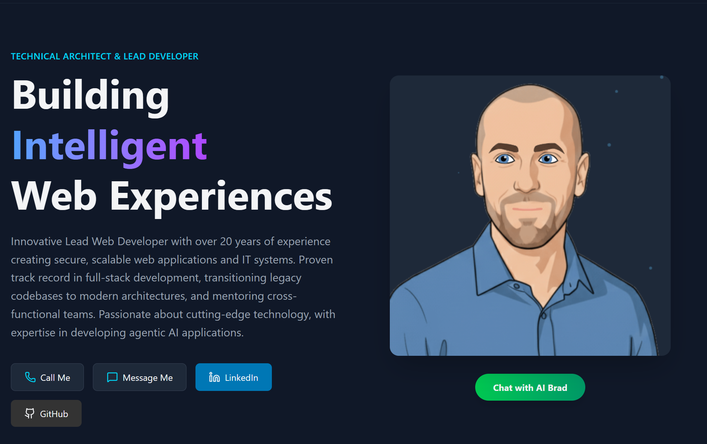

# Brad Foster - AI-Powered Interactive Portfolio

A modern, interactive portfolio website featuring an AI-powered talking avatar that can answer questions about my professional experience, skills, and personal interests in real-time using voice conversation.

### 🌐 [Live Demo → bradfoster.co.uk](https://bradfoster.co.uk)




## ✨ Features

### 🗣️ AI Talking Avatar
- **Real-time voice conversation** - Talk to "AI Brad" using your microphone
- **Audio lip-sync** - Avatar mouth animates in sync with AI speech using Web Audio API frequency analysis
- **Expressive animations** - Dynamic eyebrow and eye movements based on conversation context (happy, surprised, thinking, etc.)
- **Natural speech** - Powered by Gemini 2.5 Flash with native audio output

### 📋 RAG-Powered CV Q&A
The AI has access to tools that retrieve real resume data:
- Work history and current role
- Technical skills (filterable by category)
- Education and qualifications
- Project portfolio
- Contact information
- Job preferences (salary, location, remote/hybrid)
- Personal interests and hobbies

### 🎨 Modern UI
- Responsive design with Tailwind CSS 4
- Smooth animations with Framer Motion
- Interactive project showcase carousel
- PDF CV generation and download

## 🏗️ Architecture

```
┌─────────────────┐     ┌──────────────────┐     ┌─────────────────┐
│   React App     │────▶│  Token Server    │────▶│  Gemini Live    │
│   (Frontend)    │     │  (Express API)   │     │  API            │
└────────┬────────┘     └──────────────────┘     └────────┬────────┘
         │                                                 │
         │  WebSocket (Audio + Text)                      │
         └────────────────────────────────────────────────┘
```

### Key Components

| Component | Description |
|-----------|-------------|
| `Avatar.tsx` | Canvas-based animated face with lip-sync and expressions |
| `useGeminiLive.ts` | Hook managing Gemini Live API connection, audio I/O, and tool calls |
| `resume.ts` | Structured resume data used by RAG tools |
| `api/server.js` | Express server for ephemeral token generation |

## 🚀 Getting Started

### Prerequisites
- Node.js 18+
- A Google AI API key with Gemini Live API access

### Installation

1. **Clone the repository**
   ```bash
   git clone https://github.com/compsmart/bradfoster.co.uk.git
   cd bradfoster.co.uk
   ```

2. **Install frontend dependencies**
   ```bash
   npm install
   ```

3. **Install API dependencies**
   ```bash
   cd api
   npm install
   ```

4. **Configure environment**
   Create `api/.env`:
   ```env
   GEMINI_API_KEY=your_gemini_api_key_here
   ```

### Running the App

1. **Start the token server** (in one terminal)
   ```bash
   cd api
   node server.js
   ```

2. **Start the frontend** (in another terminal)
   ```bash
   npm run dev
   ```

3. Open http://localhost:5173 and click **"Chat with AI Brad"**

## 🎭 Avatar Expression System

The AI can control avatar expressions during conversation using the `set_expression` tool:

| Expression | Effect |
|------------|--------|
| `neutral` | Default calm expression |
| `happy` | Raised eyebrows, squinted eyes |
| `surprised` | High raised eyebrows, wide eyes |
| `thinking` | One eyebrow raised, narrowed eyes |
| `concerned` | Lowered, tilted eyebrows |
| `excited` | Very raised eyebrows, wide eyes |
| `confused` | Asymmetric eyebrows |
| `skeptical` | One eyebrow up, one down |
| `angry` | Furrowed brows |
| `sad` | Inner corners raised |

Expressions automatically reset to neutral after 3 seconds.

## 🔊 Lip Sync Implementation

The avatar uses Web Audio API for real-time lip synchronization:

1. **Frequency Analysis** - Audio is routed through an `AnalyserNode`
2. **Vowel Detection** - Low/mid/high frequency bands detect "ah/ee" vs "oo" sounds
3. **Smooth Animation** - Multi-pass smoothing with attack/release rates
4. **Shape Blending** - Mouth morphs between wide and round shapes

See [LIPSYNC_IMPLEMENTATION.md](./LIPSYNC_IMPLEMENTATION.md) for technical details.

## 🛠️ Tech Stack

- **Frontend**: React 19, TypeScript, Vite
- **Styling**: Tailwind CSS 4, Framer Motion
- **AI**: Google Gemini 2.5 Flash (Live API with native audio)
- **Audio**: Web Audio API (AnalyserNode, ScriptProcessor)
- **Backend**: Express.js (ephemeral token server)
- **PDF**: jsPDF for CV generation

## 📁 Project Structure

```
bradfoster.co.uk/
├── src/
│   ├── components/
│   │   ├── Avatar.tsx          # Animated talking avatar
│   │   ├── ProjectShowcase.tsx # Project carousel
│   │   └── PdfModal.tsx        # CV download modal
│   ├── hooks/
│   │   └── useGeminiLive.ts    # Gemini Live API integration
│   ├── data/
│   │   └── resume.ts           # Structured CV data
│   └── App.tsx                 # Main application
├── api/
│   └── server.js               # Token generation server
└── public/
    └── images/                 # Avatar assets
```

## 🔒 Security

- API keys are kept server-side only
- Frontend uses ephemeral tokens (30-minute expiry, single use)
- CORS restricted to development origins

## 📄 License

MIT License - feel free to use this as a template for your own interactive portfolio!

## 👤 About Me

I'm Brad Foster, a Technical Architect and Lead Developer from Manchester, UK with 15+ years of experience in full-stack development and AI integration. Currently working at Playtech, building enterprise-scale systems.

- 📧 Email: brad@compsmart.co.uk
- 💼 LinkedIn: [linkedin.com/in/bradfoster](https://linkedin.com/in/bradfoster)
- 🌐 Portfolio: [bradfoster.co.uk](https://bradfoster.co.uk)
